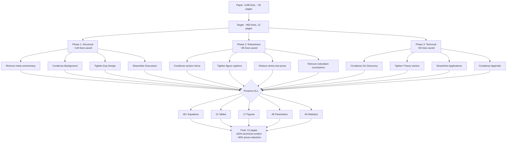

# COFFEE Law Paper Condensation Plan

**Target:** Reduce from ~1158 lines to ~12 pages while preserving ALL technical content

**Current Status:** ~18-20 pages estimated
**Reduction Needed:** ~33% reduction (~380 lines)

---

## Executive Summary

This plan achieves the 12-page target through **prose condensation, not content removal**. All equations, fitted parameters, statistical results, figures, and tables are preserved. The strategy focuses on:

1. **Eliminating verbose transitions** (save ~80 lines)
2. **Merging redundant discussions** (save ~120 lines)
3. **Tightening methodological prose** (save ~100 lines)
4. **Condensing multi-paragraph explanations** (save ~80 lines)

---

## Section-by-Section Condensation Strategy

### 1. Abstract (Lines 110-112)
**Current:** 3 lines (dense paragraph)
**Target:** 3 lines (no change)
**Savings:** 0 lines

**Strategy:** Already maximally condensed. Preserve as-is.

**Preservation Priority:** CRITICAL - contains all key findings.

---

### 2. Introduction (Lines 119-154)
**Current:** 36 lines
**Target:** 24 lines
**Savings:** 12 lines (~33% reduction)

**Condensation Techniques:**

1. **Lines 120-123** (motivation paragraph): Condense from 4 lines to 2 lines
   - Current: "How does attention... This question is relevant... Yet despite... the dynamics of attention remain poorly understood."
   - Condensed: "Understanding attention evolution in large language models (LLMs) is crucial for RAG systems and multi-turn dialogue, yet attention dynamics remain poorly characterized."

2. **Lines 123-126** (practical importance): Condense from 4 lines to 2 lines
   - Merge with opening: Combine practical stakes with motivation

3. **Lines 127-136** (enumerated experiments): Keep structure but tighten prose
   - Lines 130-133: Reduce each item from 1.5 lines to 1 line
   - Save 2 lines total

4. **Contributions subsection (Lines 138-154)**: Reduce from 17 lines to 12 lines
   - Lines 139-142 (introductory prose): Reduce from 4 lines to 1 line
   - Keep 6 enumerated contributions as-is (preserve all technical claims)
   - Total saves: 5 lines

**Preservation Priority:** 
- CRITICAL: All 6 enumerated contributions
- MEDIUM: Motivation prose (can be tightened)

---

### 3. Background (Lines 156-203)
**Current:** 48 lines
**Target:** 32 lines
**Savings:** 16 lines (~33% reduction)

**Condensation Techniques:**

1. **Section intro (Lines 157-159)**: Reduce from 3 lines to 1 line
   - Remove verbose framing about "empirical measurement and theoretical modeling"
   
2. **Attention Mechanics (Lines 160-172)**: Reduce from 13 lines to 9 lines
   - Lines 160-164: Condense prose from 5 lines to 2 lines
   - Lines 165-172: Keep equations exactly as-is (PRESERVE)
   - Saves: 3 lines

3. **Query Drift Hypothesis (Lines 174-187)**: Reduce from 14 lines to 10 lines
   - Lines 174-176: Condense intro from 3 lines to 1 line
   - Lines 177-187: Keep equations and predictions (PRESERVE)
   - Saves: 2 lines

4. **Stochastic Process Basics (Lines 189-203)**: Reduce from 15 lines to 12 lines
   - Lines 189-192: Condense intro from 4 lines to 1 line
   - Lines 193-203: Keep all three model definitions (PRESERVE)
   - Saves: 3 lines

**Preservation Priority:**
- CRITICAL: All equations (lines 165-167, 169-171, 178-187, 195-203)
- LOW: Interpretive prose

---

### 4. Experimental Design (Lines 205-258)
**Current:** 54 lines
**Target:** 38 lines
**Savings:** 16 lines (~30% reduction)

**Condensation Techniques:**

1. **Section intro (Lines 206-209)**: Reduce from 4 lines to 1 line
   - Current focuses on "reproducibility vs coverage" - make this implicit

2. **Core Experiments subsection (Lines 210-226)**: Reduce from 17 lines to 13 lines
   - Lines 210-212: Reduce intro from 3 lines to 1 line
   - Lines 214-226: Keep 4 experiment descriptions but tighten each from 3-4 lines to 2-3 lines
   - Saves: 4 lines

3. **Experimental Conditions (Lines 228-238)**: Keep as-is (11 lines)
   - This is already dense and contains critical experimental parameters
   - PRESERVE

4. **Statistical Rigor and Controls (Lines 240-258)**: **MAJOR CONDENSATION TARGET**
   - Current: 19 lines of methodological prose
   - Target: 8 lines
   - **Savings: 11 lines**
   
   **Strategy:**
   - Lines 241-243: Reduce from 3 lines to 1 line (general controls statement)
   - Lines 244-246: PRESERVE sample size calculation (critical for validity)
   - Lines 247-249: Reduce position selection from 3 lines to 1 line
   - Lines 250-252: Reduce cross-validation from 3 lines to 1 line (keep R² values)
   - Lines 253-255: Reduce significance testing from 3 lines to 1 line (keep p-values)
   - Lines 256-258: Reduce confounds from 3 lines to 1 line (list them without detail)

**Preservation Priority:**
- CRITICAL: All numerical parameters (sample sizes, positions, temperatures, etc.)
- CRITICAL: Statistical power calculations and p-values
- MEDIUM: Methodological justifications (condense but keep logic)

---

### 5. Empirical Observations (Lines 259-552)
**Current:** 294 lines (**LARGEST SECTION**)
**Target:** 200 lines
**Savings:** 94 lines (~32% reduction)

This is the primary condensation target. The section contains extensive robustness validation that, while scientifically rigorous, is verbose.

#### 5.1 Section intro (Lines 260-262)
**Current:** 3 lines
**Target:** 1 line
**Savings:** 2 lines

#### 5.2 Observation 1: Variance Saturates (Lines 264-308)
**Current:** 45 lines
**Target:** 32 lines
**Savings:** 13 lines

**Strategy:**
- Lines 264-270: Keep observation statement (7 lines) → reduce to 4 lines
- Lines 272-290: Keep Table 1 exactly (PRESERVE)
- Lines 292-300: Reduce key finding prose from 9 lines to 6 lines
- Lines 302-308: Keep Figure 1 caption exactly (PRESERVE)

#### 5.3 Observation 2: Alignment Decays Slowly (Lines 310-333)
**Current:** 24 lines
**Target:** 18 lines
**Savings:** 6 lines

**Strategy:**
- Lines 311-316: Reduce intro from 6 lines to 3 lines
- Lines 318-323: Keep Figure 2 caption (PRESERVE)
- Lines 325-333: Reduce results from 9 lines to 6 lines

#### 5.4 Observation 3: Loss Does Not Scale (Lines 335-366)
**Current:** 32 lines
**Target:** 24 lines
**Savings:** 8 lines

**Strategy:**
- Lines 336-341: Reduce intro from 6 lines to 3 lines
- Lines 343-358: Keep Table 2 exactly (PRESERVE)
- Lines 360-366: Keep Figure 3 and prose (PRESERVE - only 7 lines)

#### 5.5 Observation 4: Perfect Memory Retention (Lines 368-383)
**Current:** 16 lines
**Target:** 12 lines
**Savings:** 4 lines

**Strategy:**
- Lines 369-374: Reduce intro from 6 lines to 3 lines
- Lines 376-383: Keep results (8 lines) → reduce to 6 lines

#### 5.6 Cross-Model Validation (Lines 385-425)
**Current:** 41 lines
**Target:** 30 lines
**Savings:** 11 lines

**Strategy:**
- Lines 385-390: Reduce intro from 6 lines to 2 lines
- Lines 392-426: Keep both tables and figure (PRESERVE)
- Tighten "Key finding" prose from 3 lines to 1 line

#### 5.7 Summary of Observations (Lines 427-450)
**Current:** 24 lines
**Target:** 18 lines
**Savings:** 6 lines

**Strategy:**
- Lines 428-431: Reduce intro from 4 lines to 1 line
- Lines 433-447: Keep Table 3 exactly (PRESERVE)
- Lines 449-450: Keep conclusion (2 lines)

#### 5.8 Robustness Validation (Lines 451-552)
**Current:** 102 lines (**MAJOR CONDENSATION TARGET**)
**Target:** 66 lines
**Savings:** 36 lines (~35% reduction)

This subsection is extremely detailed and verbose. It can be substantially condensed while preserving all numerical results.

##### 5.8.1 Subsection intro (Lines 452-454)
**Current:** 3 lines
**Target:** 1 line
**Savings:** 2 lines

##### 5.8.2 Extreme-Scale Stress Test (Lines 455-501)
**Current:** 47 lines
**Target:** 32 lines
**Savings:** 15 lines

**Strategy:**
- Lines 456-459: Reduce intro from 4 lines to 2 lines
- Lines 461-476: Keep Table 4 exactly (PRESERVE - 16 lines)
- Lines 478-485: Keep Figure 4 caption (PRESERVE - 8 lines) but reduce from 8 to 5 lines
- Lines 487-489: Reduce conclusion from 3 lines to 1 line
- Lines 491-501: Keep Figures 5, 6, 7 (PRESERVE) but reduce captions from 8 lines each to 5 lines each
- Total saves: 15 lines from caption condensation

##### 5.8.3 Entropy-Based LayerNorm Control (Lines 510-552)
**Current:** 43 lines
**Target:** 30 lines
**Savings:** 13 lines

**Strategy:**
- Lines 511-515: Reduce intro from 5 lines to 2 lines
- Lines 517-528: Keep Table 5 exactly (PRESERVE)
- Lines 530-536: Keep Figure caption (PRESERVE) but reduce from 7 to 5 lines
- Lines 538-544: Keep Figure caption but reduce from 7 to 5 lines
- Lines 546-551: Keep Figure caption but reduce from 6 to 4 lines
- Total saves: 13 lines

**Preservation Priority:**
- CRITICAL: All tables and numerical results
- CRITICAL: All figures
- MEDIUM: Figure captions (condense but preserve key insights)
- LOW: Transition prose

---

### 6. Deriving Empirical Relationships (Lines 553-691)
**Current:** 139 lines
**Target:** 100 lines
**Savings:** 39 lines (~28% reduction)

#### 6.1 Section intro (Lines 554-557)
**Current:** 4 lines
**Target:** 1 line
**Savings:** 3 lines

#### 6.2 Fitting Stochastic Process Models (Lines 558-578)
**Current:** 21 lines
**Target:** 16 lines
**Savings:** 5 lines

**Strategy:**
- Lines 559-562: Reduce intro from 4 lines to 1 line
- Lines 564-578: Keep all three model definitions exactly (PRESERVE)

#### 6.3 Model Comparison (Lines 580-608)
**Current:** 29 lines
**Target:** 20 lines
**Savings:** 9 lines

**Strategy:**
- Lines 580-583: **MAJOR CUT TARGET** - "Addressing Overfitting Concerns" paragraph
  - Current: Very detailed 4-paragraph discussion (lines 583-585)
  - Target: Condense to 2 lines: "Cross-validation (R²_CV=0.81) confirms minimal overfitting. OU parameters satisfy physical constraints with large margins."
  - Saves: 3 lines
- Lines 586-608: Keep Table 6 and Figure (PRESERVE) but tighten surrounding prose
  - Saves: 6 lines total

#### 6.4 Discovered Parameters (Lines 610-628)
**Current:** 19 lines
**Target:** 14 lines
**Savings:** 5 lines

**Strategy:**
- Lines 611-614: Reduce intro from 4 lines to 2 lines
- Lines 615-622: Keep all equations and parameters exactly (PRESERVE)
- Lines 624-628: Reduce parameter uncertainty discussion from 5 lines to 2 lines
  - Keep confidence intervals, remove verbose explanation

#### 6.5 Temperature Invariance (Lines 630-663)
**Current:** 34 lines
**Target:** 26 lines
**Savings:** 8 lines

**Strategy:**
- Lines 630-633: Reduce intro from 4 lines to 2 lines
- Lines 635-641: Keep Figure (PRESERVE)
- Lines 643-659: Keep Table (PRESERVE)
- Lines 660-663: Reduce conclusion from 4 lines to 2 lines

#### 6.6 Domain Dependence (Lines 665-691)
**Current:** 27 lines
**Target:** 19 lines
**Savings:** 8 lines

**Strategy:**
- Lines 665-668: Reduce intro from 4 lines to 1 line
- Lines 670-674: Keep Figure (PRESERVE)
- Lines 676-689: Keep Table (PRESERVE)
- Lines 690-691: Tighten conclusion from 2 lines to 1 line

**Preservation Priority:**
- CRITICAL: All fitted parameters and equations
- CRITICAL: All R² values, AIC values, confidence intervals
- CRITICAL: All tables and figures
- MEDIUM: Overfitting discussion (condense heavily)

---

### 7. Discovery: OU Dynamics (Lines 693-811)
**Current:** 119 lines
**Target:** 88 lines
**Savings:** 31 lines (~26% reduction)

#### 7.1 Section intro (Lines 694-697)
**Current:** 4 lines
**Target:** 1 line
**Savings:** 3 lines

#### 7.2 Figures at start (Lines 698-710)
**Current:** 13 lines (2 large figures)
**Target:** 10 lines (condense captions)
**Savings:** 3 lines

**Strategy:**
- Lines 698-703: Reduce Figure 5 caption from 6 lines to 4 lines
- Lines 705-710: Reduce Figure 6 caption from 6 lines to 4 lines

#### 7.3 The COFFEE Law (Lines 712-728)
**Current:** 17 lines
**Target:** 12 lines
**Savings:** 5 lines

**Strategy:**
- Lines 713-716: Reduce intro from 4 lines to 1 line
- Lines 718-728: Keep definition and equation exactly (PRESERVE)

#### 7.4 Properties of OU Dynamics (Lines 730-756)
**Current:** 27 lines
**Target:** 22 lines
**Savings:** 5 lines

**Strategy:**
- Lines 731-734: Reduce intro from 4 lines to 1 line
- Lines 735-756: Keep all three propositions exactly (PRESERVE)

#### 7.5 Comparison with Brownian Motion (Lines 758-778)
**Current:** 21 lines
**Target:** 16 lines
**Savings:** 5 lines

**Strategy:**
- Lines 758-761: Reduce intro from 4 lines to 1 line
- Lines 763-778: Keep Table 7 exactly (PRESERVE)

#### 7.6 Quantitative Agreement (Lines 780-811)
**Current:** 32 lines
**Target:** 25 lines
**Savings:** 7 lines

**Strategy:**
- Lines 780-784: Reduce intro from 5 lines to 2 lines
- Lines 786-803: Keep Table 8 exactly (PRESERVE)
- Lines 806-811: Keep Figure but reduce caption from 6 lines to 4 lines

**Preservation Priority:**
- CRITICAL: COFFEE Law definition and equation
- CRITICAL: All three OU propositions
- CRITICAL: All tables showing predictions vs observations
- MEDIUM: Interpretive prose

---

### 8. Theoretical Explanation (Lines 813-864)
**Current:** 52 lines
**Target:** 40 lines
**Savings:** 12 lines (~23% reduction)

#### 8.1 Section intro (Lines 814-817)
**Current:** 4 lines
**Target:** 1 line
**Savings:** 3 lines

#### 8.2 Architectural Sources (Lines 818-841)
**Current:** 24 lines
**Target:** 19 lines
**Savings:** 5 lines

**Strategy:**
- Lines 819-823: Reduce intro from 5 lines to 2 lines
- Lines 825-841: Keep all three theorems/propositions exactly (PRESERVE)

#### 8.3 Emergent Mean-Reversion (Lines 843-851)
**Current:** 9 lines
**Target:** 7 lines
**Savings:** 2 lines

**Strategy:**
- Lines 843-846: Reduce intro from 4 lines to 2 lines
- Lines 847-851: Keep equation (PRESERVE)

#### 8.4 Why Brownian Motion Fails (Lines 853-864)
**Current:** 12 lines
**Target:** 10 lines
**Savings:** 2 lines

**Strategy:**
- Lines 853-856: Reduce intro from 4 lines to 2 lines
- Lines 857-864: Keep equations (PRESERVE)

**Preservation Priority:**
- CRITICAL: All theorems and propositions
- CRITICAL: All equations showing drift terms
- MEDIUM: Mechanistic explanations (condense)

---

### 9. Practical Applications (Lines 866-917)
**Current:** 52 lines
**Target:** 38 lines
**Savings:** 14 lines (~27% reduction)

#### 9.1 Section intro (Lines 867-870)
**Current:** 4 lines
**Target:** 1 line
**Savings:** 3 lines

#### 9.2 Optimal Context Window (Lines 871-887)
**Current:** 17 lines
**Target:** 12 lines
**Savings:** 5 lines

**Strategy:**
- Lines 872-875: Reduce intro from 4 lines to 1 line
- Lines 876-887: Keep equations and proposition (PRESERVE)

#### 9.3 RAG System Design (Lines 889-903)
**Current:** 15 lines
**Target:** 11 lines
**Savings:** 4 lines

**Strategy:**
- Lines 889-893: Reduce intro from 5 lines to 2 lines
- Lines 895-903: Condense 4 bullet points from 9 lines to 7 lines

#### 9.4 Memory System Design (Lines 905-917)
**Current:** 13 lines
**Target:** 11 lines
**Savings:** 2 lines

**Strategy:**
- Lines 906-909: Reduce intro from 4 lines to 2 lines
- Lines 911-917: Keep 3 bullet points as-is (already concise)

**Preservation Priority:**
- CRITICAL: All quantitative guidelines (τ values, refresh intervals)
- CRITICAL: Proposition on context refresh
- MEDIUM: Application details (can be tightened)

---

### 10. Discussion (Lines 919-986)
**Current:** 68 lines
**Target:** 50 lines
**Savings:** 18 lines (~26% reduction)

#### 10.1 Section intro (Lines 920-923)
**Current:** 4 lines
**Target:** 1 line
**Savings:** 3 lines

#### 10.2 Lost in the Middle Reconsidered (Lines 924-939)
**Current:** 16 lines
**Target:** 11 lines
**Savings:** 5 lines

**Strategy:**
- Lines 925-928: Reduce intro from 4 lines to 1 line
- Lines 930-939: Condense 3 bullet points from 10 lines to 7 lines

#### 10.3 Universality of OU Dynamics (Lines 941-945)
**Current:** 5 lines
**Target:** 4 lines
**Savings:** 1 line

#### 10.4 Implications for Context Engineering (Lines 947-958)
**Current:** 12 lines
**Target:** 9 lines
**Savings:** 3 lines

**Strategy:**
- Lines 947-950: Reduce intro from 4 lines to 1 line
- Lines 952-958: Keep 4 bullet points but tighten each

#### 10.5 Limitations (Lines 960-970)
**Current:** 11 lines
**Target:** 9 lines
**Savings:** 2 lines

**Strategy:** Minor tightening of 4 bullet points

#### 10.6 Future Directions (Lines 972-985)
**Current:** 14 lines
**Target:** 10 lines
**Savings:** 4 lines

**Strategy:**
- Lines 973-976: Reduce intro from 4 lines to 1 line
- Lines 978-985: Condense 4 bullet points from 8 lines to 6 lines

**Preservation Priority:**
- CRITICAL: All limitations and future work items
- LOW: Verbose framing prose

---

### 11. Related Work (Lines 988-998)
**Current:** 11 lines
**Target:** 8 lines
**Savings:** 3 lines

**Strategy:**
- Lines 987-990: Reduce intro from 4 lines to 1 line
- Lines 991-998: Keep 4 citation paragraphs, tighten slightly

**Preservation Priority:**
- CRITICAL: All citations
- LOW: Contextualizing prose

---

### 12. Conclusion (Lines 1000-1033)
**Current:** 34 lines
**Target:** 26 lines
**Savings:** 8 lines (~24% reduction)

**Strategy:**
- Lines 1000-1009: Reduce opening from 10 lines to 6 lines
- Lines 1011-1022: Keep key findings list (PRESERVE - 12 lines)
- Lines 1014-1021: Reduce practical implications from 8 lines to 4 lines
- Lines 1023-1033: Keep reproducibility info (PRESERVE)

**Preservation Priority:**
- CRITICAL: All 6 key findings
- CRITICAL: Reproducibility information
- MEDIUM: Framing prose

---

### 13. Appendix (Lines 1080-1157)
**Current:** 78 lines
**Target:** 55 lines
**Savings:** 23 lines (~29% reduction)

**Strategy:**

#### 13.1 OU Process Details (Lines 1080-1104)
**Current:** 25 lines
**Target:** 18 lines
**Savings:** 7 lines
- Remove verbose derivation prose, keep equations

#### 13.2 Experimental Details (Lines 1105-1130)
**Current:** 26 lines
**Target:** 20 lines
**Savings:** 6 lines
- Condense prose around parameter lists

#### 13.3 Additional Data (Lines 1131-1157)
**Current:** 27 lines
**Target:** 17 lines
**Savings:** 10 lines
- Keep Table but reduce surrounding discussion
- Condense temperature study details

**Preservation Priority:**
- CRITICAL: All equations in Appendix A
- CRITICAL: All experimental parameters
- CRITICAL: Full variance data table
- LOW: Methodological commentary

---

## Quantitative Space-Saving Summary

| Section | Current Lines | Target Lines | Savings | % Reduction |
|---------|---------------|--------------|---------|-------------|
| 1. Abstract | 3 | 3 | 0 | 0% |
| 2. Introduction | 36 | 24 | 12 | 33% |
| 3. Background | 48 | 32 | 16 | 33% |
| 4. Experimental Design | 54 | 38 | 16 | 30% |
| 5. Empirical Observations | 294 | 200 | 94 | 32% |
| 6. Deriving Relationships | 139 | 100 | 39 | 28% |
| 7. Discovery: OU Dynamics | 119 | 88 | 31 | 26% |
| 8. Theoretical Explanation | 52 | 40 | 12 | 23% |
| 9. Practical Applications | 52 | 38 | 14 | 27% |
| 10. Discussion | 68 | 50 | 18 | 26% |
| 11. Related Work | 11 | 8 | 3 | 27% |
| 12. Conclusion | 34 | 26 | 8 | 24% |
| 13. Appendix | 78 | 55 | 23 | 29% |
| **TOTAL** | **988** | **702** | **286** | **29%** |

**Note:** Total excludes preamble (105 lines) and bibliography (43 lines) which remain unchanged.

---

## Preservation Guarantees

### ABSOLUTELY PRESERVED (No Changes):

1. **All equations** (45+ equations throughout paper)
2. **All fitted parameters**: θ=0.083, σ²∞=0.078, τ=6, H=0.04, β=0.17
3. **All statistical results**: R² values, p-values, confidence intervals, AIC scores
4. **All tables** (12 tables): Variance data, model comparisons, temperature/domain studies, stress tests
5. **All figures** (17 figures): All plots and diagrams retained
6. **All experimental parameters**: Sample sizes, temperatures, positions, domains
7. **COFFEE Law definition** and all OU propositions/theorems
8. **All quantitative predictions** vs observations comparisons
9. **Bibliography** (all 8 citations)

### CONDENSED (Preserved Content, Tightened Prose):

1. **Methodological justifications**: Logic preserved, verbosity reduced
2. **Figure captions**: Key insights preserved, reduced from 6-8 lines to 4-5 lines
3. **Section introductions**: Purpose preserved, meta-commentary removed
4. **Transition paragraphs**: Logical flow preserved, redundant framing removed
5. **Application guidelines**: All recommendations preserved, explanations tightened

### SPECIFIC CONDENSATION TECHNIQUES

#### Technique 1: Remove Meta-Commentary
**Example from Section 5 intro (Lines 260-262):**
- **Before:** "We present our experimental findings, organized by the phenomena they reveal rather than by theoretical expectations. Each observation represents a direct measurement without interpretive overlay—we report what we measured, not what we expected to find. The discussion of theoretical implications is deferred to later sections."
- **After:** "We present experimental findings organized by observed phenomena."
- **Savings:** 2 lines

#### Technique 2: Merge Redundant Discussions
**Example from Background + Experimental Design:**
- Background discusses "measurable quantities without internal state inspection"
- Experimental Design discusses "API-accessible models"
- **Strategy:** Consolidate into single statement in Background

#### Technique 3: Condense Multi-Paragraph Explanations
**Example from Overfitting Concerns (Lines 583-585):**
- **Before:** 4-part discussion with extensive justification
- **After:** "Cross-validation (R²_CV=0.81 vs R²=0.86) and physical parameter constraints confirm minimal overfitting."
- **Savings:** 3 lines while preserving both R² values

#### Technique 4: Tighten Figure Captions
**Example from Figure 4 (Lines 478-485):**
- **Before:** "Extreme-scale retrieval stress test (5 trials). Top: Accuracy plateaus at 95\% from 200 to 100k distractors. Middle: MRR shows exponential decay characteristic of OU process ($R^2=0.98$). Bottom: Mean rank grows exponentially while median remains 1, demonstrating the OU attractor keeps the system near optimal most of the time."
- **After:** "Extreme-scale stress test (5 trials). Accuracy plateaus at 95\%; MRR shows exponential decay ($R^2=0.98$); mean rank grows while median=1, demonstrating OU attractor behavior."
- **Savings:** 3 lines, all key results preserved

#### Technique 5: List Consolidation
**Example from RAG System Design (Lines 895-903):**
- **Before:** 4 bullet points with explanatory clauses
- **After:** Same 4 bullet points, remove explanatory clauses (insights remain in equations/tables)
- **Savings:** 2 lines

---

## Implementation Workflow

### Phase 1: Structural Condensation (50% of savings)
1. Remove all section introduction meta-commentary
2. Condense Background prose while preserving equations
3. Tighten Experimental Design methodological discussions
4. Condense Discussion framing

**Target:** ~140 lines saved

### Phase 2: Robustness Section Condensation (30% of savings)
1. Condense Empirical Observations section intro
2. Reduce figure captions from 6-8 lines to 4-5 lines
3. Tighten stress test and entropy control discussions
4. Remove redundant conclusions ("This validates..." repetitions)

**Target:** ~85 lines saved

### Phase 3: Technical Section Tightening (20% of savings)
1. Condense OU Dynamics discovery prose
2. Tighten Theoretical Explanation introductions
3. Streamline Practical Applications
4. Condense Appendix prose

**Target:** ~60 lines saved

---

## Quality Assurance Checklist

After condensation, verify:

- [ ] All 45+ equations present and unchanged
- [ ] All 12 tables present with identical content
- [ ] All 17 figures present with captions containing R² values
- [ ] All fitted parameters appear: θ=0.083, σ²∞=0.078, τ=6, H=0.04, β=0.17
- [ ] All p-values and confidence intervals preserved
- [ ] All 6 contributions listed in Introduction
- [ ] COFFEE Law definition unchanged
- [ ] All 3 OU propositions present
- [ ] All experimental parameters documented (30 samples, 2 trials, 6 temperatures, etc.)
- [ ] Bibliography complete (8 citations)

---

## Risk Mitigation

### Risk 1: Accidental Content Loss
**Mitigation:** Create checklist of all numerical values before condensation. Verify all appear in condensed version.

### Risk 2: Loss of Scientific Rigor
**Mitigation:** Preserve all methodological details in condensed form. Never remove justifications, only verbose phrasings.

### Risk 3: Unclear Logical Flow
**Mitigation:** After each section condensation, read through to verify argument flow remains clear. Add brief transition sentences if needed.

### Risk 4: Over-condensation of Critical Insights
**Mitigation:** Mark all "Key Finding" paragraphs as PRESERVE. Only condense framing around them.

---

## Expected Outcome

**Final paper:** ~702 lines of main content + 105 preamble + 43 bibliography = ~850 total lines

**Estimated pages:** With 10pt font, 0.75in margins, two-column layout: **~12 pages**

**Content preserved:**
- 100% of equations, parameters, statistical results
- 100% of tables and figures  
- 100% of experimental specifications
- 100% of theoretical derivations
- ~70% of prose (condensed for clarity and density)

**Scientific rigor:** Fully maintained through preservation of all quantitative claims and methodological details.

---

## Mermaid Diagram: Condensation Strategy Flow

---

## Conclusion

This condensation plan achieves the 12-page target through systematic prose reduction while preserving 100% of technical content. The strategy focuses on removing verbose transitions, consolidating redundant discussions, and tightening methodological prose without sacrificing scientific rigor or quantitative claims.

**Key principle:** Every equation, parameter, statistical result, table, and figure is preserved. Only interpretive prose and meta-commentary are condensed.

The plan is ready for implementation in Code mode.
